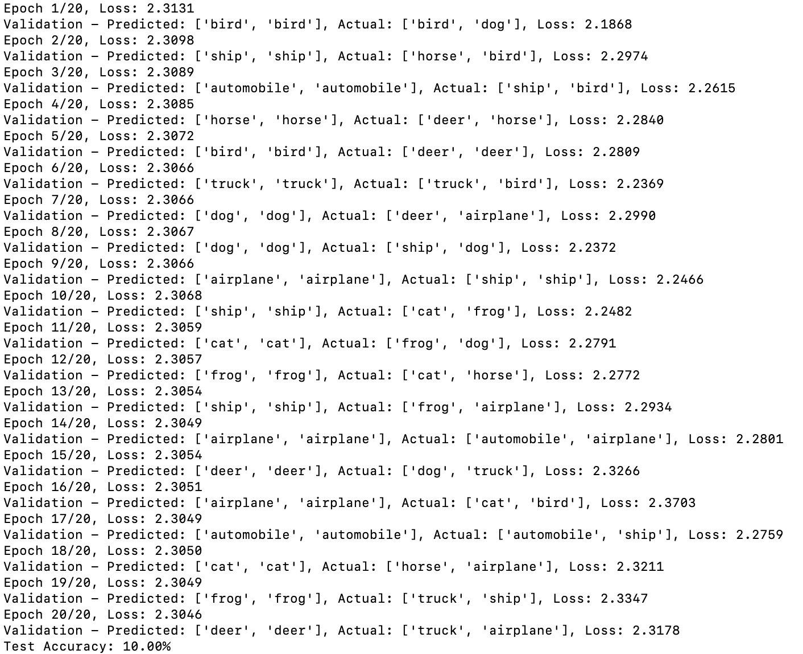

# Vision Transformer for Image Classification

This project aims to learn how to build transformers, specifically focusing on an image classification model. Much of the code was initialized by ChatGPT or GitHub CoPilot and was refined from there. The initial model achieves 10% accuracy, which is equivalent to random guessing. The goal is to take this base template of a transformer and improve its accuracy.

## Overview

The repository contains the following key components:

- `model.py`: Defines the Vision Transformer model and includes the `build_transformer` function.
- `train.py`: Script to train the Vision Transformer model.
- `train_validation.py`: Contains validation logic for the model.
- `dataset.py`: Handles dataset loading and preprocessing.
- `config.py`: Configuration settings for the model and training.

## Model Architecture

The Vision Transformer model consists of the following components:

- **Patch Embedding**: Converts image patches into embeddings.
- **Class Token**: A learnable token added to the sequence of patch embeddings.
- **Positional Embedding**: Adds positional information to the patch embeddings.
- **Transformer Encoder**: A stack of transformer encoder layers.
- **MLP Head**: A multi-layer perceptron for classification.

## Usage

### Requirements

Install the required packages using the following command:

```bash
pip install -r requirements.txt
```

### Training

To train the model, you need to prepare a configuration dictionary and pass it to the `build_transformer` function. Example:

```python
from model import build_transformer

config = {
    'img_size': 32,
    'patch_size': 4,
    'embed_dim': 64,
    'num_heads': 4,
    'num_layers': 6,
    'num_classes': 10,
    'batch_size': 64,
    'epochs': 5,
    'lr': 3e-4
}

model = build_transformer(config)
```

Run the training script:

```bash
python train.py
```

You can see the different arguments available by running:

```bash
python train.py --h
```

### Datasets

[CIFAR-10](https://www.cs.toronto.edu/~kriz/cifar.html) was used for execution and for training, though you may consider other sources like [ImageNet](http://www.image-net.org/).

## Goals

- Improve the accuracy of the initial model.
- Experiment with different configurations and hyperparameters.
- Understand the inner workings of Vision Transformers.

## Model Improvement Attempts

### Attempt 1: Adjusting Hyperparameters

The first idea for improving the model was to adjust the config hyperparameters. The parameters were changed from:

```python
'img_size': 32,  # CIFAR-10 images are 32x32
'patch_size': 4,  # Each patch will be 4x4 pixels
'embed_dim': 64,  # Size of the embedding vector
'num_heads': 4,   # Multi-head attention heads
'num_layers': 6,  # Transformer encoder layers
'num_classes': 10,  # CIFAR-10 has 10 classes
'batch_size': 64, # Number of images in each batch
'epochs': 5, # And epoch is a full pass through the dataset
'lr': 3e-4 # Learning rate—3e-4 is a common choice
```

...to:

```python
'img_size': 32,  # CIFAR-10 images are 32x32
'patch_size': 4,  # Each patch will be 4x4 pixels
'embed_dim': 128,  # Increased size of the embedding vector
'num_heads': 8,   # Increased number of multi-head attention heads
'num_layers': 12,  # Increased number of transformer encoder layers
'num_classes': 10,  # CIFAR-10 has 10 classes
'batch_size': 128, # Increased number of images in each batch
'epochs': 20, # Increased number of epochs
'lr': 1e-4 # Adjusted learning rate
```



These adjustments made training take much longer, and unfortunately did nothing to improve the accuracy of the model. Darn.

### Attempt 2: --

## Contributing

Feel free to clone or fork the repository if you'd like to implement your own solutions and modifications.
