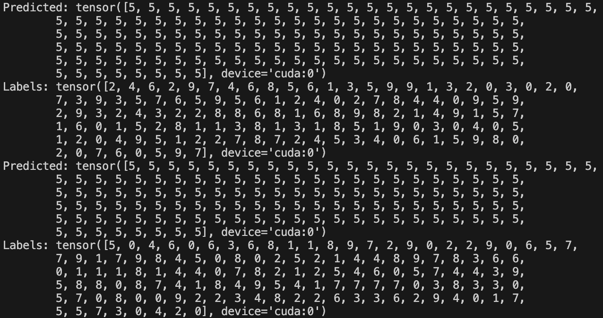
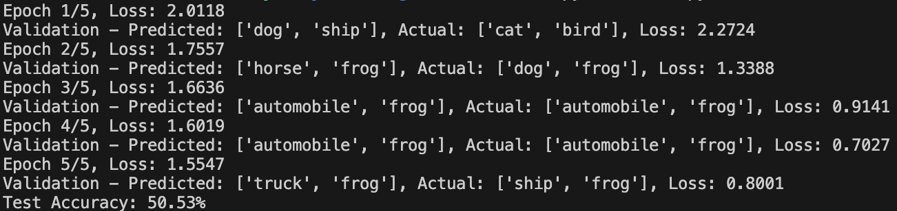
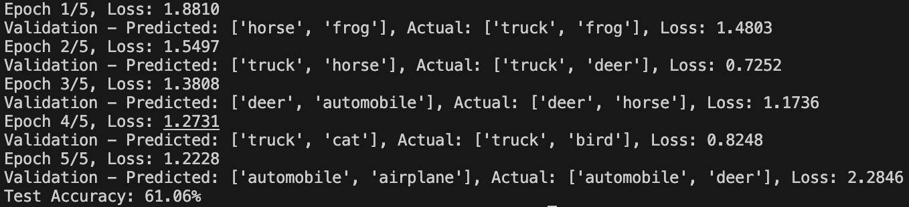
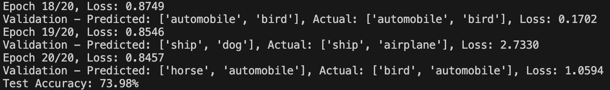

# Vision Transformer for Image Classification

This project aims to learn how to build transformers, specifically focusing on an image classification model. Much of the code was initialized by ChatGPT or GitHub CoPilot and was refined from there. The initial model achieves 10% accuracy, which is equivalent to random guessing. The goal is to take this base template of a transformer and improve its accuracy.

## Overview

The repository contains the following key components:

- `train.py`: Script to train the model. This is the main file for the project.
- `model.py`: Defines the Vision Transformer (ViT) model, the optional convolutional neural network (CNN) mode, and includes helper functions like `build_transformer` and `build_cnn`.
- `train_validation.py`: Contains validation logic for the model.
- `dataset.py`: Handles dataset loading, preprocessing, and normalization.
- `config.py`: Configuration settings for the model and training.

## Model Architecture

The Vision Transformer model consists of the following components, though these components are mostly behind the scenes:

- **Patch Embedding**: Converts image patches into embeddings.
- **Class Token**: A learnable token added to the sequence of patch embeddings.
- **Positional Embedding**: Adds positional information to the patch embeddings.
- **Transformer Encoder**: A stack of transformer encoder layers.
- **MLP Head**: A multi-layer perceptron for classification.

## Usage

### Requirements

Install the required packages using the following command:

```bash
pip install -r requirements.txt
```

### Training

To train the model, you need to prepare a configuration dictionary and pass it to the `build_transformer` function. Example:

```python
from model import build_transformer

config = {
    'img_size': 32,
    'patch_size': 4,
    'embed_dim': 64,
    'num_heads': 4,
    'num_layers': 6,
    'num_classes': 10,
    'batch_size': 64,
    'epochs': 5,
    'lr': 3e-4
}

model = build_transformer(config)
```

Run the training script:

```bash
python train.py
```

You can see the different arguments available by running:

```bash
python train.py --h
```

### Datasets

[CIFAR-10](https://www.cs.toronto.edu/~kriz/cifar.html) was used for execution and for training, though you may consider other sources like [ImageNet](http://www.image-net.org/).

## Goals

- Improve the accuracy of the initial model.
- Experiment with different configurations and hyperparameters.
- Understand the inner workings of Vision Transformers (ViT).

## Model Improvement Attempts

### Attempt 1: Adjusting Hyperparameters

The first idea for improving the model was to adjust the config hyperparameters. The parameters were changed from:

```python
'img_size': 32,  # CIFAR-10 images are 32x32
'patch_size': 4,  # Each patch will be 4x4 pixels
'embed_dim': 64,  # Size of the embedding vector
'num_heads': 4,   # Multi-head attention heads
'num_layers': 6,  # Transformer encoder layers
'num_classes': 10,  # CIFAR-10 has 10 classes
'batch_size': 64, # Number of images in each batch
'epochs': 5, # An epoch is a full pass through the dataset
'lr': 3e-4 # Learning rate—3e-4 is a common choice
```

...to:

```python
'img_size': 32,  # CIFAR-10 images are 32x32
'patch_size': 4,  # Each patch will be 4x4 pixels
'embed_dim': 128,  # Increased size of the embedding vector
'num_heads': 8,   # Increased number of multi-head attention heads
'num_layers': 12,  # Increased number of transformer encoder layers
'num_classes': 10,  # CIFAR-10 has 10 classes
'batch_size': 128, # Increased number of images in each batch
'epochs': 20, # Increased number of epochs
'lr': 1e-4 # Adjusted learning rate
```


These adjustments made training take much longer, and unfortunately did nothing to improve the accuracy of the model. Darn.

### Attempt 2: Diving Into Model Accuracy and Trying CNNs

One thing that stood out while running the tests was that each time it finished, the output would be: "Test Accuracy: 10.00%". Besides being a terrible accuracy, it was always exactly 10.00%—not 10.50%, not 9.00%. The code for this seemed accurate and straightforward, so it could indicate a problem with the model not learning properly, which would be indicated by predictions always being the same class. 

If you look in the above image showing the results and validations, you'll see the model outputs `Validation - Predicted: [item1, item2]`, and each time, both items are the same—not from one epoch to the next but in the same epoch. To our hypothesis is correct in that it always predicts the same class, we can adjust our `train.py` code as follows:

```python
# Evaluate model
    model.eval()
    correct, total = 0, 0
    with torch.no_grad():
        for images, labels in test_loader:
            images, labels = images.to(device), labels.to(device)
            outputs = model(images)
            _, predicted = torch.max(outputs, 1)
            total += labels.size(0)
            correct += (predicted == labels).sum().item()
            
            # TWO PRINT LINES FOR DEBUGGING
            print(f"Predicted: {predicted}")
            print(f"Labels: {labels}")
    
    print(f"Test Accuracy: {100 * correct / total:.2f}%")
```

And here is part of the output of that:



Yeah, that's going to be a problem. It predicts the same class every single time. Let's see what we can do about this.

Poking around on the internet, we come across [this article](https://www.kaggle.com/code/faressayah/cifar-10-images-classification-using-cnns-88), which goes step-by-step through the CIFAR10 image classification problem, but this time using TensorFlow instead of PyTorch. They also use a [Convolutional Neural Network](https://en.wikipedia.org/wiki/Convolutional_neural_network) instead of a [Vision Transformer (ViT)](https://arxiv.org/abs/2010.11929). While eventually we'd like to get a ViT to work here, we can try a CNN instead for now.

```python
# Added to model.py
...
import torch.nn.functional as F

...

class SimpleCNN(nn.Module):
    def __init__(self, num_classes=10):
        super(SimpleCNN, self).__init__()
        self.conv1 = nn.Conv2d(3, 32, kernel_size=3, padding=1)
        self.conv2 = nn.Conv2d(32, 64, kernel_size=3, padding=1)
        self.conv3 = nn.Conv2d(64, 128, kernel_size=3, padding=1)
        self.pool = nn.MaxPool2d(kernel_size=2, stride=2, padding=0)
        self.dropout = nn.Dropout(0.25)
        self.fc1 = nn.Linear(128 * 4 * 4, 512)
        self.fc2 = nn.Linear(512, num_classes)

    def forward(self, x):
        x = self.pool(F.relu(self.conv1(x)))
        x = self.pool(F.relu(self.conv2(x)))
        x = self.pool(F.relu(self.conv3(x)))
        x = x.view(-1, 128 * 4 * 4)
        x = F.relu(self.fc1(x))
        x = self.dropout(x)
        x = self.fc2(x)
        return x

def build_cnn(config):
    return SimpleCNN(num_classes=config['num_classes'])
```

...and adjusting `train.py`:
```python
...
from model import build_transformer, build_cnn

...

def train_model(config, validate_with_images=False):
    # Initialize model, loss, and optimizer
    device = get_device()
    #model = get_model(config).to(device)
    model = build_cnn(config).to(device)
    ...
```

Wow, just with 5 epochs, we are seeing some big improvements:



### Attempt 3: Fixing the VisionTransformer

With the previous attempt, we found out that the problem was our model. The implementation of the CNN model worked much better than our implementation of our ViT, but according to [this paper](https://arxiv.org/abs/2010.11929), a ViT should be able to work for this use case. Let's see if we can fix our first implementation of it. Mind you, I am not familiar with any of this math or why one model is better than another, I'm just trying to implement work that has already been done before, and I'm doing it with a lot of help from ChatGPT and GitHub CoPilot.

While trying to fix our model, it can be helpful to find versions of the model that already work. I was able to find a few sources online, including [this very official-looking model](https://github.com/pytorch/vision/blob/main/torchvision/models/vision_transformer.py), [this Medium walkthrough](https://medium.com/thedeephub/building-vision-transformer-from-scratch-using-pytorch-an-image-worth-16x16-words-24db5f159e27), and [this Lightning.ai tutorial](https://lightning.ai/docs/pytorch/stable/notebooks/course_UvA-DL/11-vision-transformer.html). Again, most of these didn't make much sense to me when I was looking at them—aside from some familiar bits of code here and there—but the more needed skill here was being able to identify sources that could be relevant, whether you can understand them or not.

Plugging these sources into ChatGPT allowed it to give me some new code that began to work, and was even more accurate than the CNN model through 5 epochs:



Ok, so ChatGPT did some magic, but what changed? What did it change in the code to make it work? For a side-by-side code diff provided by [w3docs](https://www.w3docs.com/tools/code-diff/), you can go [here](resources/modelCodeDiffAdjustment3.pdf). At a very high level, we changed the code to be more stable, efficient, and better initialized due to:
- [Conv2d-based patch embedding](https://pytorch.org/docs/stable/generated/torch.nn.Conv2d.html) (faster and more stable).
- [Pre-normalization](https://sh-tsang.medium.com/review-pre-ln-transformer-on-layer-normalization-in-the-transformer-architecture-b6c91a89e9ab) in the transformer encoder.
- [Truncated normal initialization](https://medium.com/@ohadrubin/conversations-with-gpt-4-weight-initialization-with-the-truncated-normal-distribution-78a9f71bc478) (avoids extreme values).
- [Gaussian error linear unit (GELU)](https://paperswithcode.com/method/gelu) activation (smoother training).
- [LayerNorm](https://pytorch.org/docs/stable/generated/torch.nn.LayerNorm.html) before classification (stabilizes training).

Again, I wish I understood the math and concepts behind this, but for now we will have to suffice with being able to implement it. Along the way, we also made changes to `dataset.py` to make it so the model could better handle more normalized data.

Ok, so this is a big accomplishment, but we soon run into our next problem—our accuracy is not going up as much as we'd like with increased epochs.



## Contributing

Feel free to clone or fork the repository if you'd like to implement your own solutions and modifications.
